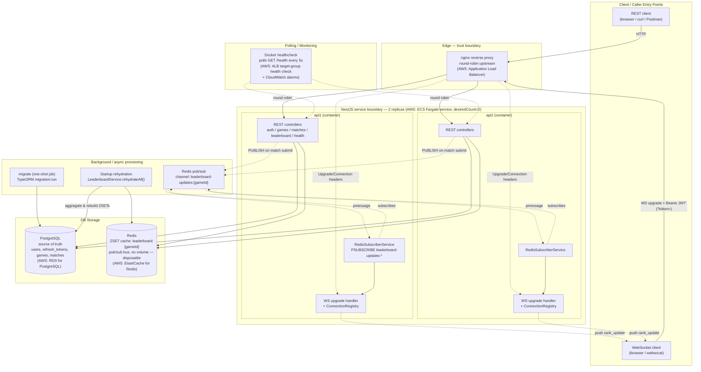

# 1. System Architecture View

> **Domain-mapping note:** `docs/diagram-requirements.md` is a generic template
> (it references document upload/extraction and an external news-monitoring
> source) that does not describe this project. This service is the
> Real-Time Gaming Leaderboard from the assignment PDF. The diagrams below
> map every required "view" onto the closest real equivalent actually built
> here, called out explicitly wherever the fit is loose - see the note at
> the top of [`04-polling-monitoring-data-flow.md`](./04-polling-monitoring-data-flow.md)
> for the biggest stretch (there is no third-party external source in this
> domain; Postgres plays that role for the rehydration flow).

This is the "as built" topology (`docker-compose.yml`), annotated with the
AWS-equivalent managed service each box would become in a production
deployment, since the project runs on plain Docker Compose rather than AWS.

**Trust boundaries:** the edge (nginx) is the only public entry point;
everything behind it (api1/api2, Postgres, Redis) is on a private Docker
network with no direct external ports needed in production (the demo compose
file exposes `3001`/`3002` directly only so the demo script can address a
specific replica). JWT validation happens at the REST `JwtAuthGuard` and at
the WS `upgrade` handler — both before any business logic runs.

**Validation:** `class-validator`/`class-transformer` DTOs at every REST
controller boundary (global `ValidationPipe`).

**Business logic:** service layer only (`MatchesService`, `LeaderboardService`,
`AuthService`, `GamesService`) — controllers stay thin.

**Persistence:** Postgres via TypeORM repositories is the only source of
truth; Redis is a rebuildable cache.

**Asynchronous behavior:** Redis pub/sub fan-out (decouples the instance that
received the HTTP write from every instance holding a live WS connection),
the one-shot `migrate` job, and boot-time cache rehydration.
