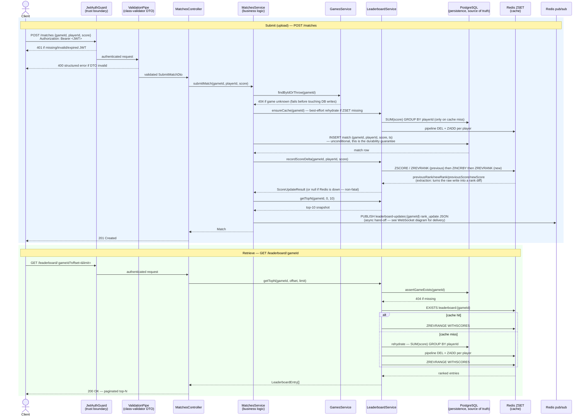

# 2. REST Data Flow — Zoomed View

Maps the required "upload, extraction, persistence, retrieval" flow onto this
project's actual REST surface: **match submission** (upload) and
**leaderboard read** (retrieval), the two REST paths that touch persistence.

**Where validation happens:** global `ValidationPipe` (`whitelist` +
`forbidNonWhitelisted` + `transform`) at the controller boundary, before any
service method runs.

**Where business logic happens:** `MatchesService`/`LeaderboardService` —
game-existence checks, cache-miss rehydration ordering (cache is warmed
*before* the Postgres write to avoid double-counting), rank-diff computation.

**Where persistence happens:** `MatchesRepository`/TypeORM against Postgres
only; Redis is never the write-of-record.

**Where asynchronous behavior exists:** the `PUBLISH` at the end of submit is
fire-and-forget from the REST request's perspective — the HTTP response does
not wait for any WebSocket client to receive the update.
