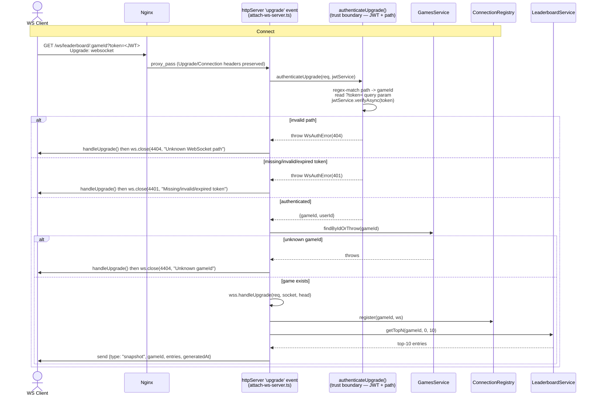
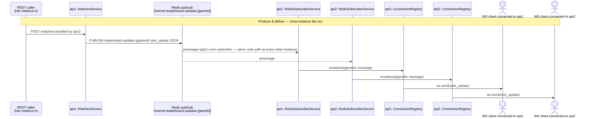

# 3. WebSocket Data Flow — Zoomed View

Shows how a local client connects (`WS /ws/leaderboard/:gameId`) and how a
`rank_update` event produced on one instance is delivered to clients
connected to *any* instance.

A close frame can only be sent from the WS `OPEN` state, so every rejection
path still completes `handleUpgrade()` before immediately calling
`ws.close(code, reason)` — the socket is never registered and never sent a
snapshot in the rejection cases; see `attach-ws-server.ts`.

`MatchesService` never touches `ConnectionRegistry` directly — the instance
that received the HTTP write reaches its own local sockets through the exact
same Redis subscription path as every other instance, which is what makes
in-process-only broadcast structurally impossible to reintroduce by accident.

**Heartbeat / dead-connection cleanup:** `ConnectionRegistry.startHeartbeat()`
pings every open socket every 30s; a socket that didn't `pong` since the last
sweep is `terminate()`d and removed. `close`/`error` events also unregister
immediately, so a game with zero remaining sockets is dropped from the map.

**Graceful shutdown:** `SIGTERM`/`SIGINT` → `stopHeartbeat()` →
`closeAll()` (closes every socket with code `1001`) → drain → `app.close()`.

**Trust boundary:** JWT validation happens in `authenticateUpgrade()` before
`handleUpgrade()` is ever called for a legitimate connection — no
unauthenticated socket is ever registered or reaches business logic.
