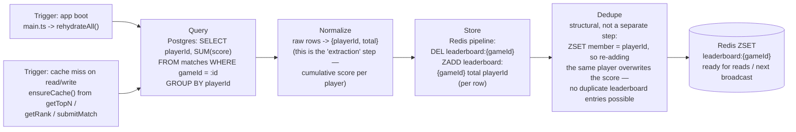
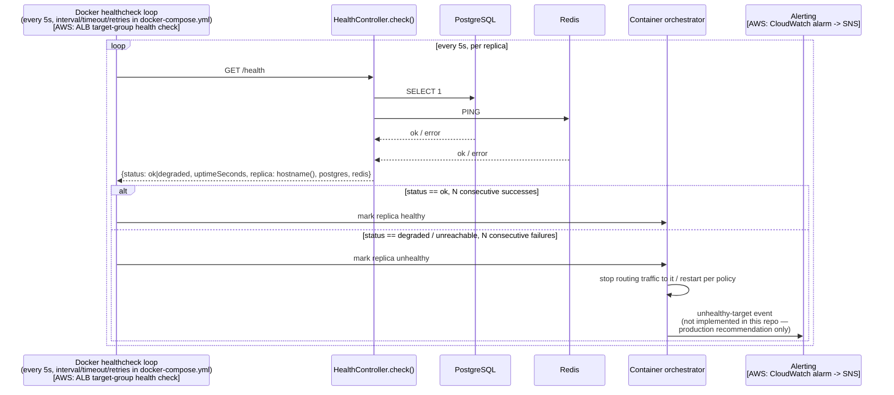

# 4. Polling & Monitoring Data Flow — Zoomed View

> **Interpretation note:** this required view is written for a
> document/news-monitoring domain ("monitored data queried, normalized,
> stored, deduplicated, turned into alert events") that this project doesn't
> have — there is no third-party external source being polled here. This is
> the loosest-fitting mapping of the four required views; per the chosen
> approach it's force-fit onto the closest real equivalents actually built:
> **(a)** the Redis cache-rehydration path, which is a genuine
> query → normalize → store → dedupe pipeline, just sourced from this
> service's own Postgres rather than an external feed, and **(b)** the
> health-check poll loop, which is the genuine "monitoring → alert" surface
> in this system.

## (a) Cache rehydration — the "query, normalize, store, dedupe" pipeline

Note the ordering guarantee documented in `LeaderboardService.ensureCache`:
it is always called **before** the new match row is written to Postgres, so a
cache-miss rehydrate can never re-aggregate a row that a subsequent
`ZINCRBY` would then double-count.

## (b) Health monitoring — the "turned into alert events" step

**Where this differs from a real monitoring pipeline:** in this project the
"alert event" is only ever a Docker Compose restart decision (or, in the AWS
production target, an ALB target-group state change) — there is no
persisted alert history, dedupe window, or paging integration, since nothing
in the assignment's actual scope calls for one. A genuine alerting/dedup
layer (e.g. CloudWatch alarm → SNS → on-call) is listed as the production
recommendation, not something this repo implements.
